# Learning With Sakura

## 这是什么

学习的日常进度记录

## 目前进度

<details>
<summary>Week1-5:学习C++并编写简单的STL</summary>

### 主项目
传送门：[My-Tiny-STL](https://github.com/ChenyuZhuWhiskey/MyTinySTL)

### 总结
- 主要配合侯捷视频以及SGI STL编写。STL分为6个组件：allocator，iterator，container，functor，adaptor，algorithm
- allocator(simple)：内存分配
	- 分配内存(allocate)的过程实际上就是`operator::new`的包装，`operator::new`就是`malloc`。BTW，没有必要使用侯捷推崇的内存池分配法，因为GNU C的`malloc()`本来就是在用内存池，侯捷没读过`malloc()`的源代码张口就莱。
	- deallocate的过程则包装了free()
	- construct:调用构造函数`::new()`
	- destruct:这里使用了模板偏特化的技巧，对于`__IS_POD_TYPE()`为`__true_type`的(primitive)，跳过析构过程，对于`__IS_POD_TYPE()`为`__false_type`(对象)则调用析构函数
- iterator：迭代器实际上就是泛化的指针，不同的iter操作级别不同，forward只能向前，bidirectional能向前向后，random_access能任意加减(一般指向连续空间的容器，比如vector)
- adaptor：简单容器改造一下得到的其他容器
- container：容器是STL提供的标准数据结构，我在myTinySTL中实现了几个比较重要的数据结构：
	- vector：三根指向连续内存，空间不够时申请一块2*size的新内存然后用`initialized_copy()`拷贝赋值
		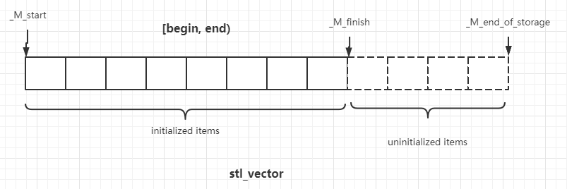	
	- list：双向链表，首尾相连（环状）
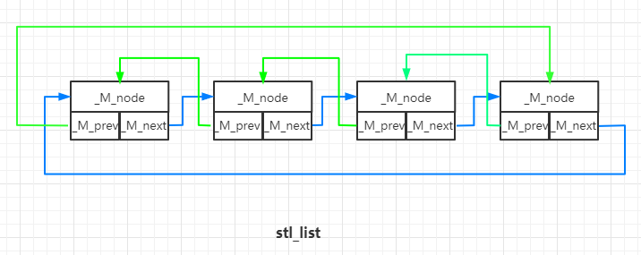
	- tree:红黑树。
由于在写STL时没有系统学习过数据结构，因此补充了一下数据结构的知识。搜索树结构实际上启发于binary search，对于一个定义了比较的并且sorted in ordered的sequence，我们就可以使用binary search将复杂度降到log(n)。于是想到构造一种二叉搜索树：
```C++
struct BSTree{
  _Data data;
  BSTree* left;
  BSTree* right;
};
```
其中满足性质`left < data, right > data`，因此在搜索节点时就可以使用binary search了：
```C++
static BSTree* Search(BSTree* __tree, _Data& __data){
    if(!__tree){
        return nullptr;
    }
    if(__data.equal(__tree.data)){
        return __tree;
    }
    if(__data > __tree.data){
        return Search(__tree->right, __data);
    }else{
        return Search(__tree->left, __data);
    }
}
```
但如果全部节点集中在left或者right，那么`BSTree`就退化成了有序链表，搜索复杂度重新变回o(N)。于是我们就想办法改进一下。
#### B Tree
构造一个叫B Tree的结构，让每一个节点能存储L个数据，并且让这个节点能连接L+1个子节点，这样每个数据就对应了一个left和right，并且我们形式上保留BSTree的`left<data, right>data`。
#### Rotation
另外一种改进方法就是定义rotation操作。leftrorate就是把这个节点和`__tree.right`交换位置，让父节点指向它，然后它再移动到`__tree.right`的`left`上，通过有限次的`rotate`操作，我们可以将`BSTree`变成最佳的平衡二叉状态。
#### 红黑树
##### 定义与性质
有了前面的两种优化思路，我们就能定义红黑树了，红黑树其实就是`2-3Tree + Btree`,我们知道，B Tree其实在形式上已经高度平衡了，但肯定是BSTree才能用，那么我们就做一个约定将2-3 Tree转化为BSTree，这种带有约定的BStree就是红黑树：
split一个node后，右着（大的）成为父节点
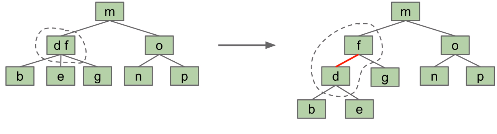
同时，将split后的边标为红色，其余为黑色。
根据这个定义，我们能得到红黑树的两条性质：

- 一个节点不可能有两条红色的边
- 根节点到每一条路径的黑色边数量相等
性质一是显然的，假如一个节点有两条红边，对应的2-3Tree就是这样：
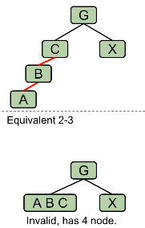
显然违反了2-3Tree的定义。
性质二也是显然的，2-3Tree本来就是平衡树，split只会产生新的红边，那么每个路径通过的黑边自然相同。
根据性质1和2，能得到推论：
- 红黑树root到leaf最大路径长度是2N+1，其中N是黑边数量
证明：根据性质1，一个节点不可能有两条红边，那么一个路径上边最多的情况就是红黑相间，此时红边最多N+1个，于是最大路径不超过N+(N+1)=2N+1，证毕。
根据此推论，可以得到红黑树搜索算法时间复杂度：o(logn).
##### 插入算法
对于红黑树节点的插入算法，实际上就是把2-3Tree的插入算法步骤通过定义约定映射到BSTree就行了：
- 第一步：add。add会出现两种case：insert的新值到左或者右边（其余case都是insert后不违反定义的，就不提了）
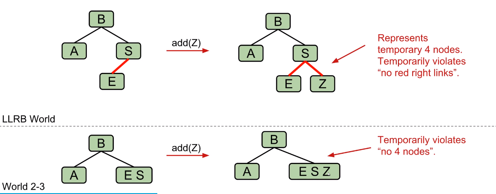
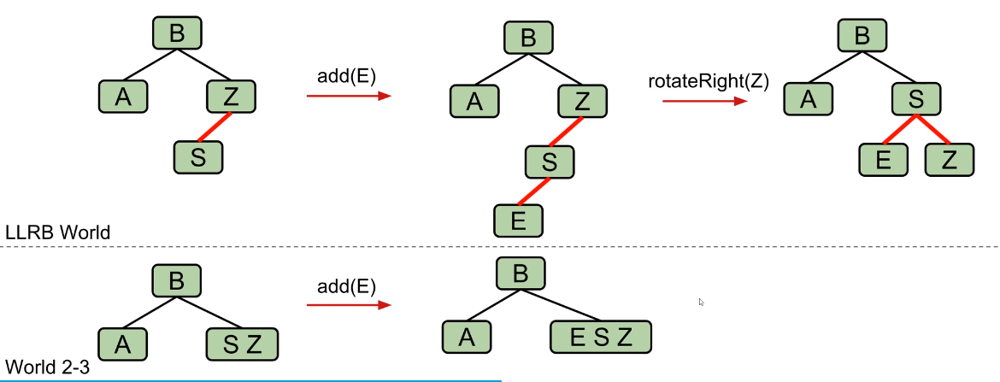
假如是case2，我们先用rotateRight将它变为case1;
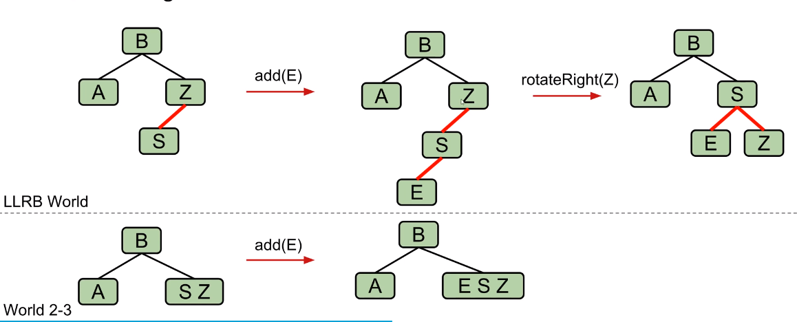
- 第二部splite：实际上就是变换边的颜色：
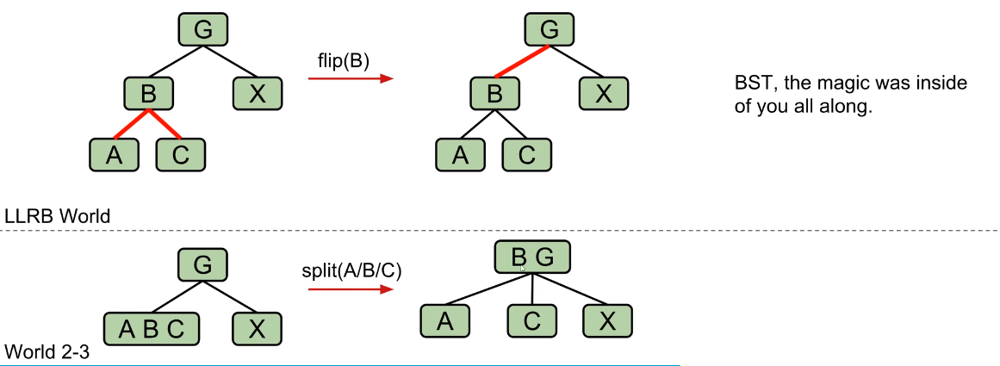
假如插入节点没有违反红黑树规则1，那么就不用flip，假如flip后父节点违反规则1，则递归进行前面步骤。
##### 顺便吐槽一下
STL C++的红黑树插入没用递归来写，代码的if嵌套极其复杂，不知道开发人员怎么想的。
	- hashtable：算是一种vector的adaptor。
#### hash table
hashtable追求的是检索时算法复杂度为o(1)。在检索时对一个数组输入key时会获得常量复杂度，hash table就基于这样的思想。hash table设计时没用什么数学，纯粹是经验。现在我有a series of obj要存储到一个空间中，并且在search时像数组输入key一样立即返回值，那么一种可行的方法如下：
- 给出一个hash func，根据obj的key计算对应hash值
- 将obj存储在对应值编号的空间中
- 如果有不同的obj计算出了相同的hash值，那就将这个空间作为链表，在保证链表长度足够短时，检索链表的迭代时间就可以忽略不计，当作常量处理
大多数hash table用的hash函数就是将key除以bucket的size取余：
```C++
size_type hash_func(Obj& __obj, Bucket& __bucket){
    return __obj.key%__bucket.size()
}
```
具体实现地话，在stl中，bucket就是一个(`std::vector<*_Node>`)，`_Node`是单链表：
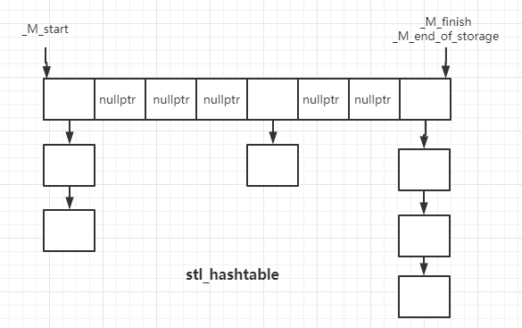
判断链表是否过长时使用一种经验方法：当插入数大于bucket的size时，就认为链表过长，此时重新申请更大空间，并按照hash函数重新分配各个obj。
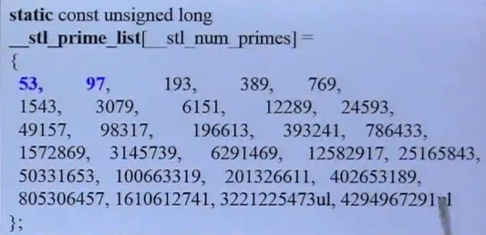
stl的size就是这么取的，第一个是53，接下来不断加倍，取最近的素数作为新的size。

 - map/set：adaptor，底层数据结构就是一个红黑树
 - hashmap/hashset：adaptor，底层数据结构就是一个hashtable.

### 思考题：

1.一些STL会误用的场景：

- 假如容器中的对象中包含指针类型，使用默认拷贝构造函数(浅拷贝)，析构时会触发UAF。一个自定义拷贝构造函数往往就对应一个析构函数，算是常识。
- vector的`erase()`不检查边界，误用会访问未初始化的内存：

```c++
#include <vector>
int main() {
    std::vector<int> test = std::vector<int>();
    test.push_back(1);
    auto iter = test.begin();
    test.erase(iter + 2);
    return 0;
}
```

- 使用`insett()`,`erase()`等会改变vector内部三根指针指向位置的method时，如果预先cache了`begin()`,`end()`,`size()`等，再使用这些method后cache的值就不等于真正的值了，可能就会导致访问未初始化的内存

2. STL中为什么要定义`uninitialized_copy/fill`和`initialized_copy/fill`两组函数？

   uninitialized_xxx是拷贝构造，会向操作系统申请容器空间。initialized_xxx是拷贝赋值，向已经申请过的内存写入。

3. 容器内存模型

   上面的图有了

</details>

<details>
<summary>Week6-9:CS143 Compiler</summary>

### 主项目

传送门：[CS143_Compiler](https://github.com/ChenyuZhuWhiskey/CS143_Compiler)

### 总结

#### Program Assignment：

- PA2：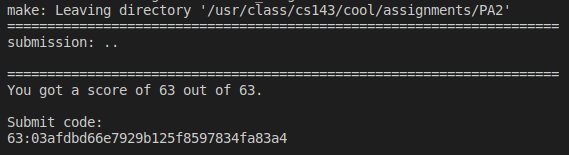

  见  https://github.com/ChenyuZhuWhiskey/CS143_Compiler/tree/master/assignments/PA2

- PA3：

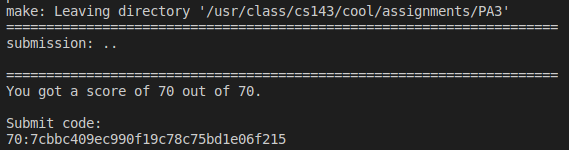

​	见 https://github.com/ChenyuZhuWhiskey/CS143_Compiler/blob/master/assignments/PA3

- PA4：

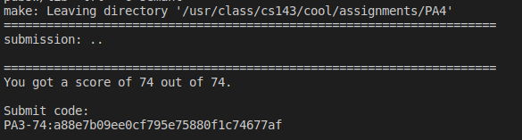

​	见 https://github.com/ChenyuZhuWhiskey/CS143_Compiler/tree/master/assignments/PA4 

##### 小插曲：

在写AST语法树的时候，因为观察到了标准答案一些语法检查是通过多态实现，所以想尝试一下使用模板偏特化实现，结果模板会把一个指向子类对象的父类指针推到为父类，然后就炸了

#### 思考题

1. 浮点数和无符号整数的文法

   浮点数：

   ```
   S -> optionalSign Int optionalDecimal optionalExp
   optionalSign -> +|-|epsilon
   Int digit | Intpart
   optionalDecimal -> .Int | epsilon
   optionalExp -> e optionalSign Int | epsilon
   digit -> 0|1|2|3|4|5|6|7|8|9|
   ```

   无符号整数：

   ```
   S -> positive A | A
   A -> A digit | digit
   digit -> 0 | positive
   positive -> 0|1|2|3|4|5|6|7|8|9|
   ```

2. 描述每种文法（LL(1),SLR, LR(1), LALR等...)的使用条件，和它是为了解决什么问题？

   LL1是为了解决自顶向下推导算法的左递归无限循环，以及backtracking导致的效率低下问题，通过每条文法的SELECT集进行预测分析，因此LL1的使用条件是每条正则文法的SELECT集不冲突，不产生歧义。

   SLR是通过每个项目的FOLLOW集来判断遇到移入-规约冲突时进行移入操作还是规约操作，主要解决LR(0)遇到的移入-规约冲突。使用前提就是他们的FOLLOW集两两不相交

   LR(1)时为了解决SLT仅仅通过FLOOW集解决移入-规约冲突的不足。有项目：

   $A \rightarrow \alpha \cdot a \beta$

   $B \rightarrow \gamma\cdot$

   若a是B的FOLLOW集，则用产生式B规约是必要条件二非充分条件。LR (1)通过向前看一个展望符构造项目集闭包的自动机来解决移入-规约冲突。LR(1)的使用条件是要求文法是LR(1)的，几乎所有context-free grammar都是LR1的。

   LALR文法主要是为了解决LR(1)劈裂LR(0)产生的状态数过于庞大的问题，主要通过合并LR(1)的同心集实现，使用前提是合并后不产生归约-归约冲突。

3. 阅读用flex和bison生成出来的cool代码lexer和parser，理清代码骨架。

   flex见博客：[https://chenyuzhuwhiskey.github.io/2020/06/21/flex-lexer%E5%88%86%E6%9E%90/](https://chenyuzhuwhiskey.github.io/2020/06/21/flex-lexer分析/) 

   bison见博客：[https://chenyuzhuwhiskey.github.io/2020/06/27/bison-parser%E6%B7%B1%E5%85%A5%E5%88%86%E6%9E%90/](https://chenyuzhuwhiskey.github.io/2020/06/27/bison-parser深入分析/)

</details>

<details>
<summary>Week10-13:CSAPP Lab</summary>

### 主项目

传送门：[Csapp-Lab](https://github.com/ChenyuZhuWhiskey/Csapp-Lab)

### 总结

- datalab：整数和浮点数二进制的操作，熟悉它们的编码规则就不难：https://github.com/ChenyuZhuWhiskey/Csapp-Lab/blob/master/DATALAB_README.md

- bomb和attack,buffer都是实施缓冲区溢出攻击，主要是学一学gdb，pwndbg，ROPgagdget这些常见工具。当ASLR开启时，栈的地址就被随机化了，然后就需要使用gagdget。

  - bomb:  https://github.com/ChenyuZhuWhiskey/Csapp-Lab/blob/master/BOMB_README.md 
  - attack ： https://github.com/ChenyuZhuWhiskey/Csapp-Lab/blob/master/ATTACKLAB_README.md 
  - buffer: https://github.com/ChenyuZhuWhiskey/Csapp-Lab/blob/master/BUFFER_README.md 

- arch lab：PartA是根据对应的c代码写它的汇编版本，挺简单的。B就是在架构中添加iaddq，也不是很难，PartC难炸了，做不来。https://github.com/ChenyuZhuWhiskey/Csapp-Lab/blob/master/ARCHLAB_README.md 

- cache lab：

  - PartA模拟缓存的工作。首先要知道缓存的算法流程：

  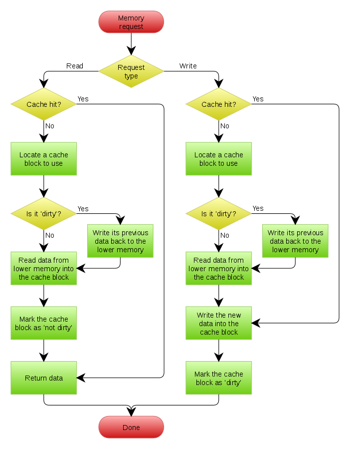

  接下来照着写就行。

  - PartB是优化矩阵转置的算法，思路就是去提高代码的时间空间局部性
  - 见：https://github.com/ChenyuZhuWhiskey/Csapp-Lab/blob/master/CACHELAB_README.md

- shell lab：写一个linux shell。照着CSAPP文中给的代码框架来就可以了。有个坑就是用bash去运行shell时，默认情况下，shell也会是bash的子进程，那么我们用ctrl+c是，实际上bash会向shell和每个子进程都发送`SIGINT`信号，这是部队的，因此在fork后execve前重写shell子进程的pid保证bash有且只有shell一个子进程

- malloc lab：花时间最多的lab，因为翻译the art of software security assessment的内存损坏漏洞时提到heap overflow的基础是对free时的frelist链表写入操作进行利用，但这里并没有写的很详细，所以除了花时间看CSAPP第九章虚拟内存以外（感觉把物理存储当作内存的cache，以及详细的页表操作对malloc lab好像帮助不大，不过对虚拟地址空间有了深入了解），还花了时间去读glibc malloc的源码，参考了CTF wiki和ptmalloc源码分析这两个资料，写了篇博客： [https://chenyuzhuwhiskey.github.io/2020/08/14/glibc-malloc-%E6%BA%90%E7%A0%81%E5%88%86%E6%9E%90/](https://chenyuzhuwhiskey.github.io/2020/08/14/glibc-malloc-源码分析/) 。不过由于时间太赶，只读了核心的数据结构部分，实际上就是内存池（链表数组）+内存池的cache（fast bin），相应size的free chunk会在对应的index中被链在链表里，并且物理相邻的free chunk会被合并，所以确实把C++的allocator交给malloc就足够了，再单独写一个内存池说不定性能还没glibc的malloc优秀。malloc lab需要实现的malloc没有那么复杂，就是内存池（小块）+平衡二叉树（大块），不过没拿到满分，可能是没有写fast bin当作内存池的cache来加快有时间空间局部性内存申请的速度

  评分：

  ```
  Team Name:evangelion
  Member 1 :Chenyu ZHU:id1
  Measuring performance with gettimeofday().
  
  Testing mm malloc
  Reading tracefile: short1-bal.rep
  Checking mm_malloc for correctness, efficiency, and performance.
  
  Results for mm malloc:
  trace  valid  util     ops      secs  Kops
   0       yes   66%      12  0.000000 24000
  Total          66%      12  0.000000 24000
  
  Perf index = 40 (util) + 40 (thru) = 80/100
  ```

</details>

<details>
<summary>Week14-20:Linux Kernel</summary>

### 主项目

还没搞完，传送门：[ucore](https://github.com/ChenyuZhuWhiskey/simple_kernel)

内核分析的博客更新中：https://chenyuzhuwhiskey.github.io/categories/%E6%93%8D%E4%BD%9C%E7%B3%BB%E7%BB%9F/

</details>

<details>
<summary>支线任务：翻译the art of software security assessment</summary>

目前已翻译:chap1,2,5,6

博客传送门：https://chenyuzhuwhiskey.github.io/categories/translate/

</details>


<details>
<summary>支线任务：leetcode</summary>

### 2020 November Leetcoding Challenge

#### Day 29: Jump Game III

Given an array of non-negative integers `arr`, you are initially positioned at `start` index of the array. When you are at index `i`, you can jump to `i + arr[i]` or `i - arr[i]`, check if you can reach to **any** index with value 0.

Notice that you can not jump outside of the array at any time.

##### Solution: BFS || DFS

这个题实际上就是用题目所给的方式遍历index，然后找到能否遍历到对应value为0

的index。使用BFS或者DFS遍历，然后用一个set记下遍历过的index就可以了。

```c++
class Solution {
public:
    bool canReach(vector<int>& arr, int start) {
        set<int> indexes; //用于储存遍历过的index
        indexes.insert(start);
        queue<int> index_que;
        index_que.push(start);
        while(!index_que.empty()){//如果queue清空，则全部index遍历完成，或者能够遍历到的index遍历完成（部分index形成了闭环）
            if(arr.at(index_que.front()) == 0){
                return true;
            }
            int tmp1 = index_que.front() + arr.at(index_que.front());
            int tmp2 = index_que.front() - arr.at(index_que.front());
            if(tmp1 < arr.size() && indexes.insert(tmp1).second) index_que.push(tmp1);
            if(tmp2 >= 0 && indexes.insert(tmp2).second) index_que.push(tmp2);
            index_que.pop();
        }
        return false;
        
    }
};
```

#### Day 30: The Skyline Problem

 A city's skyline is the outer contour of the silhouette formed by all the buildings in that city when viewed from a distance. Now suppose you are **given the locations and height of all the buildings** as shown on a cityscape photo (Figure A), write a program to **output the skyline** formed by these buildings collectively (Figure B). 


The geometric information of each building is represented by a triplet of integers `[Li, Ri, Hi]`, where `Li` and `Ri` are the x coordinates of the left and right edge of the ith building, respectively, and `Hi` is its height. It is guaranteed that `0 ≤ Li, Ri ≤ INT_MAX`, `0 < Hi ≤ INT_MAX`, and `Ri - Li > 0`. You may assume all buildings are perfect rectangles grounded on an absolutely flat surface at height 0.

For instance, the dimensions of all buildings in Figure A are recorded as: `[ [2 9 10], [3 7 15], [5 12 12], [15 20 10], [19 24 8] ] `.

The output is a list of "**key points**" (red dots in Figure B) in the format of `[ [x1,y1], [x2, y2], [x3, y3], ... ]` that uniquely defines a skyline. **A key point is the left endpoint of a horizontal line segment**. Note that the last key point, where the rightmost building ends, is merely used to mark the termination of the skyline, and always has zero height. Also, the ground in between any two adjacent buildings should be considered part of the skyline contour.

For instance, the skyline in Figure B should be represented as:`[ [2 10], [3 15], [7 12], [12 0], [15 10], [20 8], [24, 0] ]`.

**Notes:**

- The number of buildings in any input list is guaranteed to be in the range `[0, 10000]`.
- The input list is already sorted in ascending order by the left x position `Li`.
- The output list must be sorted by the x position.
- There must be no consecutive horizontal lines of equal height in the output skyline. For instance, `[...[2 3], [4 5], [7 5], [11 5], [12 7]...]` is not acceptable; the three lines of height 5 should be merged into one in the final output as such: `[...[2 3], [4 5], [12 7], ...]`


##### Solution

扫描线法：从左到右扫过，遇到左边，将高度存入set，遇到右边，将对应高度从set中删掉。用一个变量记录上一个转折点。如果上一个转折点的高度和set中最高高度不一致，则说明当前边上有一个转折点。

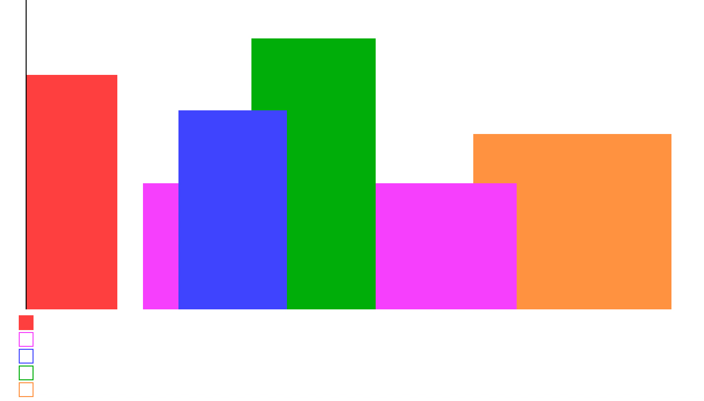

```c++
class Solution {
public:
    vector<vector<int>> getSkyline(vector<vector<int>>& buildings) {
        multiset<pair<int,int>> all;
        for(auto& e : buildings){
            all.insert(make_pair(e[0],-e[2]));
            all.insert(make_pair(e[1],e[2]));
        }
        
        multiset<int> heights({0});
        vector<int> last{0,0};
        vector<vector<int>> ret;
        for(auto& p : all){
            if(p.second < 0) heights.insert(-p.second);
            else heights.erase(heights.find(p.second));
            
            int max_height = *heights.rbegin();
            if(last[1] != max_height){
                last[0] = p.first;
                last[1] = max_height;
                ret.push_back(last);
            }
        }
        return ret;
    }
};
```

### 2020 December Leetcoding Challenge

#### Day1:  Maximum Depth of Binary Tree

Given the `root` of a binary tree, return *its maximum depth*.

A binary tree's **maximum depth** is the number of nodes along the longest path from the root node down to the farthest leaf node.

##### Solution

二叉树深度，用递归或者动态规划理解都可以，迭代公式：

`Depth(node) = 1 + max{node->left,node->right}`

```c++
/**
 * Definition for a binary tree node.
 * struct TreeNode {
 *     int val;
 *     TreeNode *left;
 *     TreeNode *right;
 *     TreeNode() : val(0), left(nullptr), right(nullptr) {}
 *     TreeNode(int x) : val(x), left(nullptr), right(nullptr) {}
 *     TreeNode(int x, TreeNode *left, TreeNode *right) : val(x), left(left), right(right) {}
 * };
 */
class Solution {
public:
    int maxDepth(TreeNode* root) {
        if(root == nullptr) return 0;
        if(root->left == nullptr && root->right == nullptr) return 1;
        return 1 + max(maxDepth(root->left), maxDepth(root->right));
    }
    
    inline int max(int val1, int val2){
        return val1 > val2 ? val1 : val2;
    }
};
```

可以优化一下，毕竟递归的调用栈会消耗更多的内存。

#### Day2:   Linked List Random Node 

Given a singly linked list, return a random node's value from the linked list. Each node must have the **same probability** of being chosen.

**Follow up:**
What if the linked list is extremely large and its length is unknown to you? Could you solve this efficiently without using extra space?

##### Solution

可以考虑一下简单的随机数生成算法XorShift生成一个32位的随机数，然后将生成数作为新的seed，这样就保证下一个生成数也是随机的，然后先在`Solution`的构造函数中得到`ListNode`的`size`，用这个随机数取余就可以了。

```c++
/**
 * Definition for singly-linked list.
 * struct ListNode {
 *     int val;
 *     ListNode *next;
 *     ListNode() : val(0), next(nullptr) {}
 *     ListNode(int x) : val(x), next(nullptr) {}
 *     ListNode(int x, ListNode *next) : val(x), next(next) {}
 * };
 */
struct xorshift32_state {
  unsigned a;
    xorshift32_state(unsigned num):a(num){}
};

/* The state word must be initialized to non-zero */
unsigned xorshift32(xorshift32_state *state)
{
	/* Algorithm "xor" from p. 4 of Marsaglia, "Xorshift RNGs" */
	unsigned x = state->a;
	x ^= x << 13;
	x ^= x >> 17;
	x ^= x << 5;
	return state->a = x;
}


class Solution {
public:
    /** @param head The linked list's head.
        Note that the head is guaranteed to be not null, so it contains at least one node. */
    Solution(ListNode* head):size(0),node(head),generator(1) {
        
        while(head != nullptr){
            size++;
            head = head->next;
        }
    }
    
    /** Returns a random node's value. */
    int getRandom() {
        this->generator = xorshift32(new xorshift32_state(this->generator));
        unsigned indx = generator  % this->size;
        ListNode* head = this->node;
        for(unsigned i = 1; i <= indx; ++i)
            head = head -> next;
        
        return head -> val;
    }
private:
    unsigned size;
    ListNode* node;
    unsigned generator;
};

/**
 * Your Solution object will be instantiated and called as such:
 * Solution* obj = new Solution(head);
 * int param_1 = obj->getRandom();
 */
```

不过这样的解法消耗的RAM好像有点点多。

</details>

